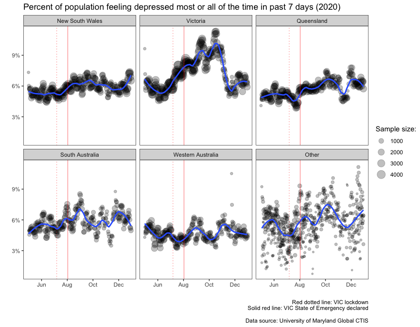

Facebook Symptom survey
================

Depression symptom survey analysis and suicide in Australia and it’s
regions.

Exploration of data from the Global COVID-19 Trends and Impact Survey,
formerly known as COVID-19 World Symptoms Survey, and Australian State
Government monthly suicide reports

## The Global COVID-19 Trends and Impact Survey

The University of Maryland Social Data Science Center [Global COVID-19
Trends and Impact
Survey](https://gisumd.github.io/COVID-19-API-Documentation/), in short
form as **UMD Global CTIS**, is a partnership between Facebook Data for
Good, Delphi Group at Carnegie Mellon University, the Joint Program on
Survey Methodology at the University of Maryland, the Duke Margolis
Center for Health Policy, and Resole to Save Lives, an initiative of
Vital Strategies. A representative sample of Facebook users was invited
on a daily basis to report on topics including, for example, symptoms,
social distancing behavior, vaccine acceptance, mental health issues,
and financial constraints. Facebook provides weights to reduce
nonresponse and coverage bias.

## State Government Monthly Suicide reports

The NSW Suicide Data Monitoring System (the System), established in
October 2020, is a collaboration between the NSW Ministry of Health,
Department of Communities and Justice, the State Coroner and NSW Police
to enable the collection and reporting of information on recent
suspected and confirmed suicides in NSW. [Monthly reports are published
by NSW
Health](https://www.health.nsw.gov.au/mentalhealth/Pages/suicide-monitoring-system.aspx).

In Victoria the Coroners Court reviews newly reported deaths on a daily
basis to identify those that occur in circumstances consistent with
suicide and adds these deaths to the Victorian Suicide Register (VSR).
The Victorian Coroners Court publishes a monthly research report on
Victorian suicide statistics in the [Coroners Court Monthly Suicide Data
Report](https://www.coronerscourt.vic.gov.au/forms-resources/publications?combine=&field_audience_target_id=All&field_publication_type_target_id=4392&year=2021).

Clone the repository, open the RStudio project, and run
`facebook-symptom-survey.R`.

  

E.g.,

<!-- -->
